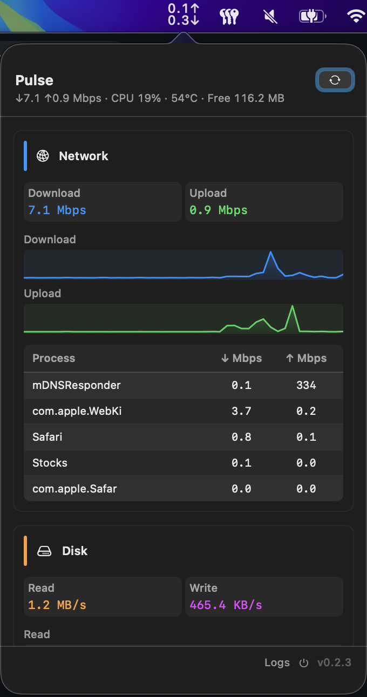

# Pulse

A lightweight macOS menu bar monitor for network, disk, CPU, GPU, memory, temperature, and fan activity.

**Current release: v0.3.1** — [Download `Pulse-0.3.1-macos-arm64.zip`](https://github.com/harmssam/workbench/releases/latest)

<div align="center">
  
</div>

## Features

- **Menu bar** — compact live Mbps readout
- **Popover dashboard** — six metric cards (Network, Disk, CPU, GPU, Memory, Thermal) with sparklines and top processes
- **Draggable cards** — reorder metrics by dragging; order is saved between launches
- **Liquid glass UI** — native `glassEffect` styling on macOS 26+, with a polished fallback on macOS 14–25
- **Thermal card** — live CPU/GPU temperatures plus animated fan icons driven by real RPM
- **Memory tools** — one-click RAM purge, with an optional aggressive purge mode in settings
- **Settings** — launch at login, auto-update, log level, and manual update checks
- **Opt-in auto-update** — disabled by default; downloads from GitHub Releases when enabled

## Requirements

| | |
|---|---|
| **Run** | macOS 14+, Apple Silicon (arm64) |
| **Liquid glass** | macOS 26+ (earlier versions use a compatible fallback theme) |
| **Build** | Swift 6, Xcode 26+ (CI uses Xcode 26.3) |

## Install

### From GitHub Releases

1. Download [`Pulse-0.3.1-macos-arm64.zip`](https://github.com/harmssam/workbench/releases/latest) from [Releases](https://github.com/harmssam/workbench/releases)
2. Unzip and copy **Pulse.app** to `/Applications`
3. Open Pulse — if macOS blocks the unsigned build, right-click and choose **Open**

### Build from source

```bash
cd apps/pulse
chmod +x build-app.sh scripts/generate-app-icon.sh
./build-app.sh
cp -r dist/Pulse.app /Applications/
open /Applications/Pulse.app
```

Pulse must live in `/Applications` (or `~/Applications`) for Login Items and stable daily use. If you launch it from a build folder, Pulse will prompt you to copy it first.

### Login at startup

Either toggle **Launch at login** in Pulse settings, or:

1. Install Pulse to `/Applications`
2. Open it once manually
3. Go to **System Settings → General → Login Items**
4. Add Pulse under **Open at Login**

## Development

```bash
cd apps/pulse
swift build
swift test
swift run          # debug — no Applications install prompt
```

## Project layout

```
apps/pulse/
├── Sources/Pulse/
│   ├── Services/       # Monitors (network, disk, CPU, GPU, memory, thermal, fans)
│   ├── Views/          # Popover, settings, sparklines, glass styling
│   ├── Models/         # Snapshots and metric card types
│   └── Utilities/      # SMC access, logging, install checks, updates
├── Tests/PulseTests/
├── build-app.sh        # Release .app bundle
├── scripts/
│   ├── release.sh      # Tag + push for CI release
│   └── generate-app-icon.sh
├── images/             # README screenshot
└── docs/               # Research and implementation notes
```

## App icon

Artwork lives in `logo/`:

- `logo.svg` — preferred when `rsvg-convert` is available
- `logo.png` — fallback (1024×1024 recommended)

`build-app.sh` generates `AppIcon.icns` and bundles it into the app. For best SVG output:

```bash
brew install librsvg
```

## Releases

Build artifacts are not committed to git. Published binaries are attached to [GitHub Releases](https://github.com/harmssam/workbench/releases).

### Build locally

```bash
chmod +x build-app.sh scripts/generate-app-icon.sh
./build-app.sh
swift test
```

### Publish via CI

```bash
chmod +x scripts/release.sh
./scripts/release.sh 0.3.1
```

This creates and pushes a `pulse-v0.3.1` tag. GitHub Actions runs tests, builds the app, packages `Pulse-0.3.1-macos-arm64.zip`, and publishes the release.

## Architecture

```
NSStatusItem + NSPopover (SwiftUI)
├── NetworkMonitor    → netstat -ib, nettop -P
├── DiskMonitor       → ioreg, proc_pid_rusage
├── CPUMonitor        → host_statistics, ps
├── GPUMonitor        → IOKit IOAccelerator
├── ThermalMonitor    → AppleSMC temperature keys
├── FanMonitor        → AppleSMC fan RPM
├── MemoryMonitor     → Mach vm_statistics64 + sysctl
├── MonitorCollector  → coordinates refresh + history buffers
└── UpdateManager     → GitHub Releases API (opt-in auto-update)
```

The popover renders draggable **metric cards** backed by rolling history buffers and sparklines. The **Thermal** card combines CPU/GPU temperature trends with animated fan icons (rotation and blur scale with actual RPM).

**Settings** (gear icon in the footer) exposes launch-at-login, auto-update, aggressive memory purge, log level, and manual update checks. When auto-update is off, available updates appear as a one-click action in the header.

On macOS 26+, popover and card chrome use SwiftUI `glassEffect`; older macOS versions fall back to translucent control backgrounds with the same layout.

## Further reading

- [Research notes](docs/research.md)
- [CPU & GPU plan](docs/cpu-gpu-plan.md)

## License

MIT — see [LICENSE](../../LICENSE).